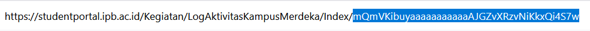

# IPB Student Portal Logbook Bot
This script automates the process of submitting logbook entries to the [Student Portal IPB University ](https://studentportal.ipb.ac.id)under the Kampus Merdeka Activity Log section. It reads activity details from an Excel file and uploads them along with file attachments.

## Features
- Reads student activity log data from an Excel file.
- Automatically retrieves session cookies from Firefox or Chrome (based on user input).
- Submits log entries and verifies whether each submission was successful.
- Outputs a summary of the upload results to a CSV log file.

## Installation
1. Clone the repository or download the script.
2. Install the required Python dependencies by running:

   ```bash
   pip install -r requirements.txt
   ```

## Input Data
data.xlsx: Contains the activity log data to be submitted.
The input Excel file should have columns corresponding to the following fields:
- **Waktu**: The date of the activity (format: DD/MM/YYYY). This will be sent as the main date field of the log entry.
- **Tstart**: Start time of the activity (format: HH:MM). This corresponds to the beginning of the mentoring or activity session.
- **Tend** End time of the activity (format: HH:MM). Marks the end of the mentoring or session period.
- **JenisLogId** An integer representing the type of activity being logged, corresponding to internal IDs used in the portal ( 1 for "Berita Acara Pembimbingan (Konsultasi/Mentoring/Coaching) ", 2 for "Berita Acara Ujian", and 3 for "Berita Acara Kegiatan").
- **IsLuring**: Indicates the mode of activity delivery. Use 0 for online ("false"), 1 for offline ("true"), and 2 for Hybrid.
- **Lokasi**: The physical or virtual location of the activity, depending on whether it was conducted offline or online (e.g., "Zoom", "Gedung Andi Hakim Nasoetion").
- **Keterangan**: Additional description of the activity.
- **FilePath**: Path to the supporting document or proof of activity (e.g., image, PDF). The script will upload this file as part of the submission.

## How to use
1. Ensure you are logged in to [IPB Student Portal](https://studentportal.ipb.ac.id) using either Firefox or Chrome.
2. Prepare your data.xlsx file in the same folder as this script.
3. Run the script:
    ```bash
   python main.py
   ```
4. When prompted:
    
- Input the aktivitasId that corresponds to your Kampus Merdeka activity.
    
    **Open your activity logbook.**
    
    For example, if your URL looks like this:

    

    your aktivitasID is: `mQmVKibuyaaaaaaaaaaaAJGZvXRzvNiKkxQi4S7w`

- Input the browser you used to log in: "firefox" or "chrome".

5. After execution, check hasil_upload.csv for success or failure of each log entry.


## License
This project is open source and free to use. Modify it as needed for your requirements.